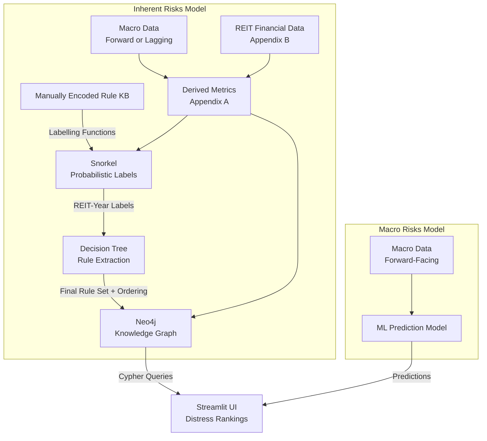

## Project Report

## REITterratsel: Equity Risk Solver for S-REITs

Intelligent Reasoning Systems

Prepared by:

| Student Name | Student ID |
|---|---|
| Jason Tay Neng Wei | A0265092A |

## Table of Contents

| Section | Description |
|---|---|
| 1 | Executive Summary |
| 2 | Business Case / Market Research |
| 3 | System Design / Model |
| 4 | System Development & Implementation |
| 5 | Findings and Discussion |
| 6 | Future Work |
| 7 | References |
| Appendix A | Project Proposal |
| Appendix B | Mapped System Functionalities against MR, RS, CGS Modules |
| Appendix C | Installation and User Guide |

## 1. Executive Summary

<!--- Not Filled in because slop -->

## 2. Business Case / Market Research

## 2.1. Business Case

Singapore REITs (S-REITs) are income-oriented instruments that are highly exposed to financing costs, refinancing structure, and macroeconomic variables, on top of their internal accounting health statistics. 

Recent sector stress is especially relevant because S-REIT balance sheets are sensitive to higher debt costs and refinancing walls. There are known recurrent risks such as debt-cost sensitivity, refinancing risk, and valuation compression. 

For example, geopolitical stress events such as rate regime changes and black swan events (COVID-19, Operation Epic Fury 2026) can propagate into downstream distress for S-REITs, as was demonstrated with notable S-REIT distresses such as Lippo Malls Indonesia Retail Trust (D5IU) and Prime US REIT (OXMU).

Under the revised MAS framework, a REIT with `ICR < 1.5x` can be blocked from taking on additional debt even if its aggregate leverage is still low. In practical terms, a REIT may appear lightly geared on paper yet still face funding stress if weaker earnings push interest coverage below the regulatory threshold.

For example, a REIT with 20% gearing but `ICR = 1.2x` may still be unable to borrow for recovery or refinancing needs, leading to shareholder dilution or price impact.

## 2.2. Competitive Positioning

There are a variety of public, simple yield screens when selecting S-REITs available to Singapore retail investors. 

- **[REITsavvy Screener](https://reitsavvy.com/reits-screener)**, which exposes filters and raw metrics but leaves reasoning to the user.
- **[Fifth Person](http://sreit.fifthperson.com)**, which presents live S-REIT data for general reference but does not encode rule-based distress scoring.
- **[DBS Research InsightsDirect](https://www.dbs.com/insightsdirect/)**, which contains analyst reasoning but is episodic, institutional, and not transparently rerunnable by a retail user.

Existing tools either display metrics without reasoning (REITsavvy, Fifth Person) or apply reasoning episodically behind institutional paywalls (DBS Research). There is a lack of quantitative evaluation available that captures the safety of current S-REITs, or whether current distributions remain sustainable under changing policy and inflation. 

This project addresses that gap by building intelligent reasoning systems that combine macro regime signals with REIT-level financial health indicators.


## 2.3. Literature Review
The existing literature provided several design lessons that were directly useful. Shumway showed that distress prediction improves when the model is kept strictly time-ordered and observable at the point of prediction, rather than built from static snapshots that blur timing discipline [1, Sec. III, p. 111; Sec. IV.B, p. 115; Sec. V, pp. 116-117]. Campbell extended that logic by combining slower accounting anchors with faster-moving market variables, including lagged return paths and volatility, so that risk can still update between reporting dates [2, Sec. 2, pp. 6-7; Sec. 3, pp. 10-12; Appendix, pp. 28-29]. Martyushev et al. reinforced the same broad lesson in a more recent machine-learning setting: temporal structure, engineered lag features, and disciplined holdout evaluation materially improve predictive usefulness [4, Sec. 3.4; Sec. 3.7; Sec. 4.2].

The literature also supported keeping the output interpretable rather than purely predictive. Cheng, Su, and Li treated financial distress as a graded state through fuzzy modelling instead of forcing a hard binary boundary, while Campbell showed that risk should be allowed to move when new market information arrives even if the accounting base is unchanged [3, Sec. "Fuzzy Regression Model," p. 87; Eq. 12, pp. 83-84] [2, Sec. 2, p. 7; Sec. 3, p. 10, Eq. (1)]. Those two ideas are reflected in this project's intended design and final structure: an annual Mamdani reasoning layer provides the stable accounting anchor, while the macro and Cumulative Abnormal Returns (CAR)-path overlays update the score when conditions change before the next annual filing.

At the same time, the existing literature left several gaps that this project chose to address. The papers written by Shumway, Campbell, and Cheng were developed for general corporate distress settings rather than the specific constraints of S-REITs, where leverage caps, refinancing pressure, mandatory distributions, and MAS coverage rules can become binding well before formal insolvency [1, Sec. I, pp. 101-104] [2, Sec. 1, pp. 1-5] [3, Sec. "Research Restrictions," p. 84]. Cheng also acknowledged that a ratio-only framework omits broader business-cycle and non-financial effects [3, Sec. "Research Restrictions," p. 84]. This project addresses that gap by combining REIT-specific financial ratios with a macro rate-stress layer and explicit MAS-linked reasoning instead of treating distress as solely a firm-failure problem.

Another gap was architectural. The prior papers mainly used single-model prediction pipelines, whereas this project separates the problem into three linked parts: an annual fuzzy anchor from accounting fundamentals, a macro overlay "watchdog" from forward rate conditions, and a market-reaction overlay from cumulative abnormal returns. That design choice is closest in spirit to Campbell's multi-speed view of risk and to Cheng's emphasis on explainable graded outputs, but it goes further by turning those ideas into a hybrid decision-support system tailored to S-REIT monitoring instead of a single standalone prediction model [2, Sec. 2, pp. 6-7; Sec. 3, pp. 10-12] [3, Sec. "Results," pp. 84-90] [4, Sec. 3.6.4; Sec. 3.7; Sec. 4.2].

## 3. System Design / Model

## 3.1. Original Design

The original proposal described a hybrid reasoning architecture that combined induced rules from Snorkel weak supervision, Orange/Decision Tree rule extraction, Neo4j storage, and a Streamlit front end. The design emphasized explainability first, with the macro model acting as an additional overlay rather than replacing the reasoning layer.

The original Mermaid architecture from the proposal is reproduced below because it is still useful for showing the intended starting point:



Although the final design incorporates the bulk of this architecture, Snorkel and decision-tree induction were removed during implementation due to the additional overhead that using Snorkel's voting LF functions entailed. The current implementation now relies on threshold-derived labels and a seeded Mamdani fuzzy rule system evaluated in Python. The final architecture is therefore best described as a design evolution rather than a straight proposal-to-code translation.

## 3.2. Data Definitions

## 3.2.1. Labels / Ground Truth

The project does not use hand-labelled distress classes as its ground truth. Instead, it derives the annual label from how each REIT performs against the sector after its fiscal-year-end filing anchor.

For each ticker-period, the pipeline takes the first trading day on or after the fiscal year end, then compounds forward abnormal returns over 63 and 126 trading days. Here, abnormal return means:

`REIT daily return - SGX iEdge REIT index daily return`

The main label used in the project is `label_126wd`, which is derived from `car_126wd` and stored in `reit_labels.fact_distress_label` together with the anchor date, forward-window end dates, and data-quality counts such as `null_count` and `non_ok_count`.

In practical terms, this means the system treats market reaction after the annual anchor as the closest available proxy for distress. Rather than asking whether the REIT price fell in isolation, it asks whether the REIT materially underperformed or outperformed the S-REIT benchmark over the following half-year window. That makes the label more suitable for this project than a raw price move or an informal manual class.

## 3.2.2. Theoretical Benchmark

The benchmark in this project is not a single external label set. Instead, each part of the system is judged against the role it is supposed to play.

For the annual distress layer, the practical benchmark is whether the model's classification agrees with `label_126wd`, which is the project's own ground-truth label derived from forward 126-trading-day abnormal returns. In other words, the annual reasoning layer is evaluated by asking a simple question: does its distress judgement line up with the later relative market outcome for that REIT?

For the macro layer, the benchmark is narrower. The XGBoost model is not trying to predict firm distress directly. It is trying to predict short-horizon SORA movement well enough to act as a useful rate-stress overlay. That is why its performance is assessed through holdout forecasting results rather than by comparing it straight to `label_126wd`.

The final evaluation then brings the system views together and compares four levels of interpretation: a simple baseline, the annual Mamdani score, a REFI-only stress proxy, and the full hybrid score. This matters because it shows whether the added complexity is actually useful. If the hybrid score cannot outperform the simpler views, then the macro and CAR-path overlays are not earning their place in the design.

## 3.2.3. Threshold-Based Label Engineering Rationale

The label thresholds are intentionally simple and conservative. If `car_126wd < -15%`, the REIT is labelled `DISTRESSED`. If `car_126wd > +5%`, it is labelled `HEALTHY`. Everything in between is labelled `WATCH`.

This creates an intentionally asymmetric rule. A REIT is only called distressed when it materially underperforms the sector benchmark over the next 126 trading days, while a smaller positive threshold is enough to classify it as healthy. The middle range is left as `WATCH` because the market signal is not decisive enough to justify a stronger conclusion.

This matters because the project is trying to detect meaningful post-filing deterioration and ignore ordinary price noise. A wider negative threshold helps avoid calling every weak period a distress event, while the middle bucket preserves uncertainty instead of forcing borderline cases into a false healthy-or-distressed split.

In plain language, the label says that `DISTRESSED` means the REIT performed clearly worse than the sector after the filing anchor, `HEALTHY` means it held up or outperformed clearly, and `WATCH` means the evidence was mixed.

## 3.3. XGBoost / Macro Data Design

The macro model is not meant to predict REIT distress directly. Its job is narrower: estimate short-horizon movement in SORA so the app can translate rate stress into a refinancing-risk overlay for each REIT. In the deployed setup, the active target is `option2_change`, which predicts the future change in SORA over the next 10 SGX trading days rather than the absolute rate level.

This design choice matters because the project is trying to detect changes in the rate environment, and not simply restate the current regime. That is why the model gives weight to market-expectation variables such as `expected_bps`, `p_no_change`, `margin_over_second`, and `days_to_next_fomc`, while also using local term-structure signals such as `sora_term_spread_t2`, `expected_bps_minus_sora_90d`, and `sora_curve_steepness`. In plain terms, the model asks both what the market expects the Fed and rate path to do next, and what the recent local SORA curve is already implying.

The feature design also shows that the model is intentionally path-aware rather than snapshot-only. It uses lag differences, realized volatility, drawdown from recent peak, distance from moving average, and short-horizon acceleration to describe how SORA has been moving recently. This is consistent with the narrower lesson highlighted in Martyushev et al.: temporal path and trend information can be more predictive than a single point-in-time reading. The caveat is that the Martyushev paper expresses that idea through STL-derived trend components [4, Figs. 2-3, Sec. 3.4] while Reiterratsel uses manual lag and momentum features instead.

The script also makes a deliberate effort to avoid leakage and overfitting. For the active change target, it excludes `sora_level_t2` and `sora_3m_t2` because those level variables carry heavy regime information that can distort a change forecast. This is also consistent with the feature-exclusion discipline highlighted in Martyushev et al., where train-test separation and protection against near-circular inputs are treated as part of credible model design rather than as optional cleanup [4, Sec. 3.3]. The train-test split is strictly time ordered, with 70% for training, 20% for testing, and a 63-row gap in between. That gap is important because it reduces overlap ("bleeding") between feature history and forward target windows, making the holdout evaluation more credible for a time-series setting.

## 3.4. Mamdani Fuzzy Rules / Micro Data Design

The Mamdani layer is the project's annual reasoning core. Its job is to take a REIT's annual fundamentals and turn them into a graded distress score that is easier to interpret than a single hard threshold. In practice, it answers a question like: given this combination of coverage, leverage, refinancing pressure, and payout strain, does the REIT look stable, worth watching, already high risk, or close to critical?

The chosen inputs follow a deliberate hierarchy. `ICR` and `GEARING` are the strongest rule candidates because they have clear regulatory and covenant anchors. `PAYOUT_RATIO`, `DSCR`, and `REFI_RISK` are the next tier because they capture REIT-specific structural stress: whether operations can service debt, whether distributions are still supported by cash generation, and whether too much debt is concentrated in the near term. `NET_DEBT_EBITDA` and `FFO_COVERAGE` are weaker standalone anchors, so they work better as corroborating evidence than as the main basis of the system. The layer also includes `NULL_COUNT`, which is not a normal financial ratio but a derived meta-risk input built from annual missing-input status. By design, `non_ok_count` is kept separately for diagnostics and display, but it is not currently a Mamdani rule input.

The rule design reflects that hierarchy. Some rules are direct alarms because the underlying metric already has a principled threshold, such as very weak `ICR`, very weak `DSCR`, or extreme `REFI_RISK`. Other rules are confirmation or combination rules, such as weak coverage together with stretched leverage, or over-distribution together with FFO shortfall. 

This matters because the model is not trying to fuzzify every available metric. It is restricting strong rules to variables with defensible REIT-domain anchors, then using supporting variables to confirm or amplify the signal when multiple weaknesses line up.

The implementation also checks whether each ratio is trustworthy before letting it influence the score at full strength. This matters because some ratios stop behaving like normal business ratios during distress. When the underlying profit or cash base turns negative, or when the denominator becomes too small, the raw ratio can flip sign, explode in magnitude, or otherwise lose smooth business meaning. 

If a ratio is flagged as `NEGATIVE_BASE` or `DISTRESS_BASE`, the code therefore forces a distress-style interpretation because the accounting base itself is already broken. If the value is `PARTIAL`, `CLIPPED_SOURCE_SHARE`, or `LOW_DENOMINATOR`, the model reduces confidence instead of pretending the ratio is fully reliable. The final Mamdani score is then blended back toward neutral when rule activation is weak, which makes the annual signal more cautious when the underlying evidence is incomplete or unstable. Just as importantly, these fuzzy-ready interpretations are kept separate from the raw warehouse metrics rather than overwriting them, so the annual source data remains auditable.


## 3.5. Full Pipeline / Hybrid Model

The cleanest way to understand the full design is as an annual anchor with two faster-moving overlays. The annual anchor is the Mamdani score built from annual fundamentals. It represents the slower-moving balance-sheet view of distress and stays frozen until the next annual checkpoint. This is the stable base of the system because accounting weakness, leverage strain, and payout pressure do not usually reset every day.

That annual anchor is then deliberately supplemented by the earlier XGBoost and CAR-path work, because annual fundamentals alone are "frozen" and incapable of explaining how risk changes between filing dates. The XGBoost layer contributes a macro rate-stress view by predicting short-horizon SORA change. This matters because refinancing pressure is not only a function of how much debt a REIT has, but also of what the rate environment is becoming. The design therefore uses the XGBoost output as a macro shock rather than as a standalone distress classifier.

The second overlay is the daily CAR-path layer. This uses cumulative abnormal return from the same annual filing anchor to show how the market has reacted since that disclosure point. Its role is different from the macro model. The macro layer captures a broad rate regime shift that can affect the sector, while the CAR-path layer captures the REIT-specific market path after the annual anchor. In other words, the macro layer asks whether funding conditions are worsening, while the CAR-path layer asks whether this particular REIT is already trading like a weaker name.

This CAR-path layer is built from a separate daily table anchored to the same annual filing date. The anchor trading day starts at `accum_car_to_date = 0.0`, then abnormal returns are compounded forward day by day and mapped into a continuous `car_path_distress` score using the same `-15% / +5%` logic as the annual label scheme. It is important to note that this layer is not part of Mamdani rule firing. It is a separate runtime overlay.

The runtime `final_distress` score is the point where those three ideas are combined. The code starts from the frozen `distress_score_mamdani`, then adds a macro adjustment from `distress_sora` and a market-path adjustment from `car_path_distress`. `REFI_RISK` is the bridge between the annual and macro layers: a REIT with higher refinancing concentration is made more sensitive to the same macro rate shock than a REIT with lower near-term refinancing pressure. The CAR-path overlay is also given a neutral dead zone so that very small daily path moves do not cause the system to overreact too early.

This relationship is the real logic of the hybrid model. Mamdani answers the annual structural question, XGBoost answers the short-horizon rate-regime question, and CAR path answers the market-reaction question. 

The final design in `Design_v1a.txt` is therefore not three unrelated components placed side by side. It is a layered system in which annual accounting risk is treated as the base state, then adjusted at runtime by macro stress and by REIT-specific market behaviour between annual reporting dates. At runtime, the app reads the persisted annual outputs and rule traces from DuckDB rather than querying Neo4j for rule definitions live, which keeps the serving layer simpler and more reproducible.

## 3.6. UI Prototype

The UI was designed to make the hybrid model readable to a non-technical user. In practical terms, the interface is not just there to display a final distress score. Its job is to show how that score was formed, what annual anchor it came from, and how the macro and market-path overlays changed it at runtime.

The repository contains both design assets and a working implementation. The design references are stored in `Common\Frontend\DesignDoc\Reitteratsel.pdf`, `Common\Frontend\DesignDoc\figma.png`, and the branding files such as `Reiterratsel_Wordmark.svg`, while the implemented app is served from `Common\Frontend\reitteratsel_app.py`.

The current Streamlit interface exposes three pages: `Ranking`, `Individual REIT Navigator`, and `Time Series (Rates)`. These pages reflect the same three-part logic used in the system design. The Ranking page gives a sector-wide view of current runtime distress scores, the Individual REIT Navigator breaks down one selected REIT in more detail, and the Rates page shows the macro side of the system through predicted versus actual rate behaviour.

The app resolves a user-selected simulation date, preserves REIT selection across page navigation, and attaches explanatory help text to many model-derived fields so the user can trace where each displayed value comes from. It also exposes the annual Mamdani base, the macro overlay, and the CAR-path contribution separately, which makes the final score easier to interpret and challenge. The current explanation layer is a persisted text trace of the top fired rules rather than a full interactive rule-strength visualizer. For proof-of-concept purposes, the app can also surface forward-looking fields such as `car_63wd`, `car_126wd`, and `label_126wd`.

Visually, the interface follows a dashboard-style layout with custom branding and a clear information hierarchy. That visual choice is consistent with the broader aim of the project: the UI should help the user understand why a REIT is being flagged, rather than simply presenting a score with no reasoning attached.

## 4. System Development & Implementation

## 4.1. Early Development / Dead Forks

The original proposal explored a weak-supervision route using Snorkel, followed by Orange or decision-tree rule extraction. This was a reasonable starting point because the annual S-REIT dataset is small and does not come with a ready-made distress label. At an early stage, weak supervision appeared to offer a way to construct labels first and derive interpretable rules afterward.

That direction was eventually abandoned because the weak-supervision branch became difficult to maintain in a clean way. It required repeated threshold design inside the labeling functions, further adjustments to stabilise vote behaviour, and ongoing checking of confidence patterns before it could produce usable pseudo-labels. In practical terms, the method was demanding substantial effort just to maintain the intermediate label-generation stage.

Orange and decision-tree extraction did not resolve that problem. Both methods still depended on Snorkel-generated pseudo-labels rather than on the final distress target itself. This meant that the extracted rules were not primary explanations of REIT distress, but second-stage approximations of an already hand-engineered weak-labelling layer. That made them less suitable as the final reasoning core of the project.

There was also an interpretability issue. The final system needed to justify clearly why a REIT should be treated as stable, watch, high risk, or critical. The weak-labelling and rule-extraction route added extra transformation steps, more tuning decisions, and more opportunities for unstable or awkward rule outputs, without giving a corresponding improvement in explanatory value.

The project therefore moved to a more direct design. Annual labels are now engineered directly from forward CAR relative to the S-REIT benchmark. The reasoning layer is implemented as a seeded Mamdani fuzzy system with explicit inputs, thresholds, and rule logic, as mentioned previously. The remaining part of the original design is that resulting annual labels and fuzzy outputs still persist to Neo4J as well as a DuckDB cacheing layer for runtime reuse.

This change simplified the logic of the system considerably. Instead of depending on proxy labels, extracted rules, and post-hoc interpretation, the final implementation uses a direct label definition and an explicit auditable rule base. That final design is much better aligned with the project's core goal of producing an explainable REIT distress-monitoring system.

## 4.2. Data Scraping and Data Engineering

The data-engineering pipeline is easier to understand if it is separated into two parts: the annual REIT fundamentals pipeline and the macro time-series pipeline. The two pipelines are built differently because they solve different data problems.

On the REIT side, the project starts from TradingView HTML annual financial statements. Those statements are first captured as raw source material, then converted into a structured row-based format. The serializer script does not simply dump text into a flat file; it maps statement labels into a reusable schema, assigns row identifiers, and writes the result into both DuckDB and per-ticker parquet files. This stage turns messy statement exports into a queryable warehouse with consistent row structure across REITs and years.

The next step is metric engineering. `build_reit_metrics.py` reads the consolidated annual warehouse and derives the project's usable REIT indicators from it. This is where ratios such as leverage, debt-service coverage, payout strain, and refinancing-related measures are computed from the raw annual statements. The metric layer also joins in external series where needed, such as SORA 3M on or before the fiscal year end. This allows the final project to reason on a cleaned annual metric layer that has already standardized the accounting inputs, as opposed to reasoning directly on raw statement rows.

The annual outputs are then persisted in `fundamentals.duckdb`, which becomes the main warehouse used by the downstream reasoning pipeline and the app. Instead of recalculating annual accounting structure from scratch during every run, the system works from a stable warehouse snapshot that already contains standardized statement data and derived metric tables.

The macro side is more exploratory because its source data is less naturally clean. Before the model dataset is built, a full 40GB parquet dump is downloaded from a source repository containing Federal Open Market Committee sentiment data. Then, the scripts explicitly probe market and trade schemas, check timestamp availability, inspect coverage, and export filtered event data. Essentially, the macro pipeline does not assume that the source tables are already analysis-ready. I wrote multiple scripts to first check whether the underlying market records, trade records, and event fields are reliable enough to support later modelling.

After that probing stage, the macro extraction pipeline builds the time-series dataset used by the XGBoost model. The training script then joins together cleaned SORA daily data, SORA 3M data, SGX REIT index information, and FOMC-related expectation features. It aligns them on a time-safe calendar, shifts rate inputs to point-in-time-safe values, forward-fills where appropriate for calendar consistency, and constructs future SORA targets from the realized path. The resulting dataset therefore becomes a time-aligned forecasting table designed specifically for short-horizon SORA prediction.

Taken together, the data-engineering design is more deliberate than a simple scraping exercise. On the micro side, the task is to convert annual financial statements into a stable warehouse and a derived metric layer. On the macro side, the task is to validate irregular source tables and turn them into a forecasting-ready time series. The final system depends on both: the REIT warehouse provides the annual structural view, while the macro pipeline provides the faster-moving rate-stress view that is later used as a runtime overlay.

## 4.2.1. Threshold-Based Annual Label Engineering

The annual label in this project is engineered directly from post-filing market behaviour. For each REIT-year, the system takes the fiscal year end as the anchor date, rolls forward to the first available trading day on or after that date, and then compounds abnormal returns over the next 63 and 126 trading days. Abnormal return is defined as the REIT's daily return minus the SGX iEdge REIT index daily return.

The main output is `label_126wd`, which is derived from `car_126wd` and stored together with the anchor date, forward-window end dates, and diagnostic counts in `reit_labels.fact_distress_label`. In practical terms, the label evaluates: after the annual filing anchor, did the REIT materially underperform, roughly track, or clearly outperform the sector benchmark over the following half-year window?

The threshold rule is intentionally simple. As mentioned above, if `car_126wd < -15%`, the REIT is labelled `DISTRESSED`. If `car_126wd > +5%`, it is labelled `HEALTHY`. Anything in between is labelled `WATCH`.

This step is also where the earlier weak-labelling and Snorkel implementation was replaced. Instead of generating proxy labels through a separate weak-supervision model, the project defines its annual target directly from observable post-filing abnormal-return behaviour. The methodology is deliberately return-based rather than price-level-based: it compares REIT returns against the SGX iEdge REIT index, and explicitly ignores `REITN` and `REITR`, so the label reflects relative sector performance rather than raw price movement.

## 4.3. XGBoost Development

## 4.3.1. Multi-Configuration Controlled Experiment Design

The macro experiment was designed as a controlled comparison of different ways to define the prediction task, rather than as a one-shot attempt to fit a single model.

The script varies two main things: the forward horizon (in practice, I tested 1d, 3d, 5d, 7d, 10d, 14d, 21d, 63d timeframes) and the target formulation. Specifically, the pipeline supports three prediction targets: `option1_level`, which predicts the future SORA level; `option2_change`, which predicts the signed future change in SORA; and `option3_abs_change`, which predicts the absolute size of the future move regardless of direction. These targets are then compared across different short-horizon windows.

Essentially, the project is trying to identify which specific macro target is most reliably forcasted, while still remaining useful for the hybrid REIT-distress system. That is why the comparison is framed around practical usefulness as a runtime overlay. 

The final deployed choice is the signed 10-trading-day SORA change target. This was more stable and less predisposed to noise. Furthermore, it fits the later hybrid design better than predicting the absolute level of SORA, because the app mainly needs a short-horizon signal of whether refinancing conditions are becoming more or less stressful.

## 4.3.2. Hyperparameter Search Strategy

The project runs two different search strategies, Optuna and DEAP, against the same time-ordered holdout setup and then lets held-out performance decide the winner. This adversarial design allows the system (and the user) to compare and highlight issues that arise during model training.

For the signed change target, the script is not satisfied with a model that only gets the average error slightly lower. It also checks whether the model gets the direction of the rate move right, because the later distress overlay mainly cares whether refinancing conditions are worsening or easing. That is why the script evaluates directional metrics such as accuracy, F1, and AUC in addition to ordinary regression error. It also rejects weak solutions such as models that predict almost the same value every time or predict one direction too often.

The reason both Optuna and DEAP are used is simple: the project does not want to trust one tuning method blindly. Optuna searches for a strong parameter set in a more direct way, while DEAP searches the same problem from a different angle. DEAP is intentionally kept conservative because the dataset is small, so an overly aggressive search could just fit noise instead of real signal. After both searches finish, the script compares their holdout results on the same test window and keeps the better one.

## 4.4. Pipeline and Application Delivery

The delivered system is built around a simple practical idea: do the heavy pipeline work first, persist the results, and let the app read those persisted outputs at runtime. In local development mode, `run_reitteratsel.py` first runs the build pipeline and then launches the Streamlit app. That build step refreshes the annual labels, the Mamdani cache, and the rule-trace outputs before the interface opens.

This means the app is not doing the full reasoning pipeline from scratch every time a user clicks a page. Instead, the build stage prepares the warehouse tables that the interface needs, including annual metrics, annual distress labels, annual Mamdani scores, and daily CAR-path rows. The app then resolves the selected simulation date to the latest eligible annual row, the latest eligible macro snapshot, and the latest eligible CAR-path row, and combines them into the runtime `final_distress` score.

This separation between build-time persistence and runtime display is one of the most important implementation choices in the project. It makes the system easier to audit, because intermediate outputs such as `fact_distress_label`, `fact_fuzzy_cache`, and `fact_car_path_daily` can be inspected directly. It also makes the dashboard more reproducible, because the user is not depending on live rule induction or raw data recomputation at page-load time.

The same logic explains the submission design. In submission mode, the repository ships with the committed DuckDB snapshot and the app serves directly from that persisted warehouse by default. In other words, the submitted application is designed to demonstrate the final reasoning outputs reliably, while still preserving a separate rebuild path for development and refresh work.

The execution order is also deliberate. The pipeline first builds abnormal-return labels, then the daily CAR-path table, then the Mamdani input frame with `null_count` and `non_ok_count`, then seeds the Neo4j rule graph, then runs Python Mamdani inference and persists the annual fuzzy outputs, and only after that launches the app and evaluation layers. This sequencing ensures that the runtime dashboard is reading a fully prepared annual base rather than mixing partially rebuilt components.

The design also comes with explicit limits. The test window is still frozen and simulated rather than live, some annual anchors do not yet have a full forward 126-trading-day window so some `label_126wd` values remain `NULL`, and `non_ok_count` is currently persisted mainly for diagnostics rather than used directly in scoring.

## 5. Findings and Discussion

## 5.1. Evaluation for XGBoost Best Version

The best locally evidenced macro model is the `run_21` `fwd_10_days` `option2_change` model, where Optuna is the recorded winner over DEAP. It predicts the 10-trading-day forward SORA change and is the exact family wired into the runtime app.

Its holdout summary is:

- `R2 = 0.1927`
- `RMSE = 0.2528`
- `MAE = 0.2086`
- `Accuracy = 0.6795`
- `Precision = 0.5926`
- `Recall = 0.7385`
- `F1 = 0.6575`
- `AUC = 0.7341`

These are not "perfect prediction" numbers, but they are enough to justify using the macro model as an overlay rather than as the sole decision engine. That is also exactly how the system uses it. The XGBoost layer does not replace the annual reasoning layer. It nudges the final distress score in response to short-horizon rate stress.

## 5.2. Evaluation for XGBoost Historical Versions

The historical working directory exists and contains many earlier runs:

- `Common\Macro\IO\Model_Train\Working\run_0` through `run_28`

The folder also contains the safe artifacts named in the skeleton, including `shap_summary_bar.png` and `shap_summary_beeswarm.png` in multiple historical runs.

However, I did not build a reliable cross-run historical comparison table from the `Working` folder during this pass because the skeleton explicitly constrained what should be read there, and the needed comparative narrative was not already consolidated in a local summary document inside this repository.

<!--FILL A proper historical-version subsection should be completed from `Common\Macro\IO\Model_Train\Working` by reviewing the allowed SHAP images and statistics JSON files across the relevant run range. I did not find a ready-made local summary that states which exact historical runs correspond to each issue mentioned in the skeleton.-->

## 5.3. Evaluation for Mamdani Layer and Full Pipeline

The latest local evaluation output folder is:

`Common\Eval\IO\run_3`

This appears to be the current canonical final evaluation in the repository because the `IO` folder contains `run_1`, `run_2`, and `run_3`, and `run_3` is the highest-numbered run present.

The local evaluation exports include:

- `reitteratsel_eval_summary.csv`
- `reitteratsel_eval_per_class_metrics.csv`
- `reitteratsel_eval_confusion_matrices.csv`
- `reitteratsel_eval_ranking_metrics.csv`
- `reitteratsel_eval_disagreements.csv`
- `reitteratsel_eval_detail.csv`

The summary metrics show:

| Model | Label Accuracy | Macro F1 | MCC | Continuous MAE | Continuous RMSE |
|---|---:|---:|---:|---:|---:|
| `distress_baseline` | 0.3572 | 0.3553 | 0.0538 | 0.3534 | 0.4747 |
| `distress_score_mamdani` | 0.5563 | 0.5294 | 0.2969 | 0.3100 | 0.3635 |
| `distress_score_refi` | 0.2816 | 0.2817 | 0.2261 | 0.3638 | 0.5175 |
| `final_distress` | 0.5214 | 0.5188 | 0.2919 | 0.2724 | 0.3295 |

The results are interesting because they show a trade-off:

- The Mamdani annual layer has the best label accuracy.
- The final hybrid score has slightly lower label accuracy than Mamdani alone.
- The final hybrid score has the best continuous-error metrics.

That is consistent with the architecture. The hybrid score is not only trying to reproduce the annual class label. It is also trying to behave more smoothly as a continuous runtime risk score after adding macro and CAR-path information.

## 5.4. Representation Tables and Graphs

The repo already contains several directly usable report artifacts:

- XGBoost holdout summaries in `run_21`
- SHAP visual assets in `run_21`
- confusion matrices and per-class metrics in `Common\Eval\IO\run_3`

The full-pipeline confusion matrices already reveal meaningful behavior. For example:

- `distress_score_mamdani` correctly predicts `1,594` distressed rows and `4,811` watch rows.
- `final_distress` correctly predicts `1,991` distressed rows, but does so more aggressively by also pulling more watch rows into the distressed bucket.

This supports the skeleton's intuition that the hybrid model is more aggressive. It improves distressed-case capture, but it also increases over-flagging pressure on borderline names.

<!--FILL The skeleton mentions adding more realistic graphs such as residual plots or more specific confusion-matrix views. Those visuals are not yet generated as dedicated report-ready images in the local repo, even though the raw CSV outputs needed for plotting are present.-->

## 5.5. Optuna and DEAP as an Adversarial Error-Surfacing System

One useful way to describe the macro training pipeline is that the optimizer contest was not only a tuning step. It also acted as an error-surfacing mechanism. The local code and saved run artifacts support several points from the skeleton:

- the model-selection logic became important enough to formalize in `choose_winner(...)`
- Optuna trial count was explicitly set to `80`
- DEAP search settings were deliberately constrained for the small-row regime
- mutation and crossover are no longer naively extreme in the saved script

The final script suggests that the project converged toward a more disciplined search regime:

- small population
- small number of generations
- shallow trees
- moderate mutation probability
- moderate crossover probability

This matters because aggressive evolutionary search can easily optimize noise in small temporal datasets. The local comments and parameter caps imply that the final configuration was chosen to reduce that risk.

<!--FILL The skeleton asks for a documented narrative tying specific issues to runs 9-21 and to external notes under `..\REF_SELF\IRS\Working\Data\ForBoth\Consolidate_Processing.txt`. Those substantiating logs are outside this repository, so I cannot map each optimizer issue to its original discovery evidence from local sources alone.-->

## 5.6. Developed Models and Final Interpretation

The repo supports four conceptually distinct views of distress:

- `distress_baseline`
- `distress_score_mamdani`
- `distress_score_refi`
- `final_distress`

The annual Mamdani layer is the strongest single discrete classifier in the local evaluation. It improves substantially over the baseline and over the simple REFI-only proxy.

The final hybrid score appears to be more operationally aggressive. From the per-class metrics:

- `final_distress` distressed recall is `0.8545`
- `final_distress` distressed precision is `0.4413`
- `distress_score_mamdani` distressed recall is `0.6841`
- `distress_score_mamdani` distressed precision is `0.4510`

This means the hybrid score catches more distressed cases, but it also accepts more false alarms. That is almost exactly the trade-off implied in the skeleton note that the hybrid model may catch around 70 to 80 percent of distressed cases while remaining aggressive.

The practical interpretation is:

- Mamdani is the more stable annual reasoning core.
- The final hybrid score is the more sensitive live-monitoring view.
- Model `P` has enough signal to justify inclusion as a macro overlay, but not enough evidence to replace the reasoning system entirely.

## 6. Future Work

The proposal and implementation checklist together suggest a coherent future-work agenda.

First, the current repository is intentionally built on frozen and simulation-resolved data rather than on a live production feed. That is a good choice for reproducibility, but it also means the system is still a proof of concept. A production version would need:

- reliable live ingestion for both firm-level and macro data
- scheduled warehouse refresh
- automated cache rebuild orchestration
- stronger monitoring around failed upstream refreshes

Second, the current label scheme and final hybrid weights are explicitly not final. The local checklist still marks several items as unfinished:

- threshold tuning beyond the current `-15% / +5%` scheme
- deeper Mamdani calibration
- possible inclusion of `non_ok_count` in the scoring logic
- macro and CAR-path weighting refinement

Third, the app itself is functional but still has room for a more mature front end:

- browser-level QA
- richer rule-firing visualization
- closer visual alignment with the design artifacts
- better responsive handling

Fourth, the proposal's broader ambitions remain valid:

- expand coverage to more REITs or adjacent dividend vehicles
- build a more formal MLOps pipeline
- test additional macro experts or macro targets
- extend the system into a more general explainable investment-risk framework

## 7. References

Local repository references:

- `Common\PROJECT_REFERENCE_MAP.md`
- `SAMPLES\Mine\Proposal_Temp_04.md`
- `SAMPLES\Mine\MAS_Rule_Change_Risk_Implications.txt`
- `Common\Micro\5_Model_KG\DesignDocs\Design_v1a.txt`
- `Common\Micro\5_Model_KG\DesignDocs\Implementation_Checklist_v1a.md`
- `Common\Micro\5_Model_KG\mamdani_rule_seed.json`
- `Common\Micro\5_Model_KG\reitteratsel_core.py`
- `Common\Micro\4_Compute_Metrics\Data_Dict_Reit_Metrics.md`
- `Common\Macro\Pipeline_MODEL\5_XGBoost\train_p_1fold_pipeline.py`
- `Common\Macro\IO\Model_Train\Use\run_21\...`
- `Common\Eval\IO\run_3\...`
- `README.md`

External references already named in the local proposal:

- Ratner, A., Bach, S., Ehrenberg, H., Fries, J., Wu, S., and Re, C. (2017). *Snorkel: Rapid Training Data Creation with Weak Supervision*.
- BDO Singapore (2025). *REIT Leverage and Disclosure*.
- [1] T. Shumway, "Forecasting Bankruptcy More Accurately: A Simple Hazard Model," *The Journal of Business*, vol. 74, no. 1, pp. 101-124, 2001, doi: 10.1086/209665.
- [2] J. Y. Campbell, J. Hilscher, and J. Szilagyi, "In Search of Distress Risk," *NBER Working Paper* no. 12362, 2006.
- [3] W.-Y. Cheng, E. Su, and S.-J. Li, "A financial distress pre-warning study by fuzzy regression model of TSE-listed companies," *Asian Academy of Management Journal of Accounting and Finance*, vol. 2, no. 2, pp. 75-93, 2006.
- [4] N. V. Martyushev, V. Spitsin, R. V. Klyuev, L. Spitsina, V. Yu. Konyukhov, T. A. Oparina, and A. E. Boltrushevich, "Predicting firm's performance based on panel data: Using hybrid methods to improve forecast accuracy," *Mathematics*, vol. 13, no. 8, p. 1247, 2025, doi: 10.3390/math13081247.

## Appendix A. Project Proposal

The local proposal can already be summarized into a concise appendix-ready form:

- Project title:
  `REITterratsel - Equity Risk Solver for S-REITs`
- Core problem:
  transform fragmented S-REIT financial and macro data into an interpretable distress-ranking workflow.
- Original technique mix:
  knowledge-based reasoning, weak supervision, rule extraction, Neo4j knowledge graph, and Streamlit interface.
- Key change since proposal:
  the final implementation replaced Snorkel-centric labelling with threshold-based label engineering from cumulative abnormal returns.

If a full appendix copy is preferred, the raw proposal is already available at:

`SAMPLES\Mine\Proposal_Temp_04.md`

## Appendix B. Mapped System Functionalities against MR, RS, CGS Modules

The project clearly satisfies the requirement to integrate at least three IRS-related technique groups.

## Appendix B.1. Decision Automation

The Mamdani fuzzy layer is the clearest decision-automation component. It encodes domain logic into explicit rules and turns annual financial conditions into a structured distress score. The rule bundle includes direct solvency alarms, corroborating multi-metric alarms, and stability rules, which together form a machine-executable decision framework rather than a descriptive dashboard only.

## Appendix B.2. Business Resource Optimization / Evolutionary Computing

The XGBoost macro pipeline uses Optuna and DEAP for structured hyperparameter search. This is the strongest local evidence for the optimization-technique requirement. The search layer is not decorative; it materially affects which macro model configuration is promoted into the runtime overlay.

## Appendix B.3. Knowledge Discovery and Data Mining

The project contains substantial data-mining and engineering work across both the micro and macro sides:

- staged financial-statement extraction and serialization
- annual metric derivation
- market and macro schema probing
- engineered macro feature creation
- label derivation from abnormal-return behavior

This is not merely static reporting. It is a pipeline that turns raw heterogeneous data into model-ready and rule-ready information.

## Appendix B.4. Cognitive Techniques / Tools

The original architecture and the current rebuild path both involve Neo4j. In the implemented system, Neo4j is used to seed and persist the Mamdani rule graph, even though the runtime app now reads the persisted fuzzy outputs from DuckDB rather than querying Neo4j live on every page interaction. The graph layer therefore remains a real cognitive-systems component, even if it is no longer the direct runtime serving layer.

<!--FILL The skeleton asks for explicit module-link evidence using external notes under `D:\WS\-GH-A-Ref\...`. Those module-link documents are outside this repository, so I can map the techniques conceptually but cannot verify the exact slide/day references from local sources alone.-->

## Appendix C. Installation and User Guide

The repository README is already strong enough to support a largely complete appendix.

### C.1. Docker submission / demo mode

From the repository root:

```powershell
docker compose -f Common/docker-compose.yml up --build
```

Then open:

```text
http://localhost:8501
```

This serves the Streamlit app against the committed DuckDB snapshot and does not require Neo4j-backed rebuild logic for the normal demo path.

### C.2. Docker rebuild mode

If the cached DuckDB and parquet artifacts need to be regenerated, first create:

```powershell
Copy-Item Common\docker-compose.env.example Common\docker-compose.env
```

Then keep the Neo4j container settings aligned with the compose path, including:

```env
NEO4J_URI=neo4j://neo4j:7687
NEO4J_DATABASE=neo4j
NEO4J_USERNAME=neo4j
NEO4J_PASSWORD=mamdaniXGBoost
```

Run the rebuild profile:

```powershell
docker compose -f Common/docker-compose.yml --profile rebuild up --build reitteratsel-rebuild
```

After that, start the app:

```powershell
docker compose -f Common/docker-compose.yml up --build
```

### C.3. Local development mode

The project-standard Python runtime is:

- `C:\ProgramData\anaconda3\envs\env\python.exe`
- `C:\ProgramData\anaconda3\envs\env\Scripts\streamlit.exe`

Typical local development entrypoint:

```powershell
C:\ProgramData\anaconda3\envs\env\python.exe Common\Micro\5_Model_KG\run_reitteratsel.py
```

Important local-development notes:

- development mode assumes cache rebuild on launch
- root `.env` must contain the required Neo4j settings
- submission mode differs because it serves the committed DuckDB snapshot directly

### C.4. Main user-facing pages

The app exposes three primary pages:

- `Ranking`
- `Individual REIT Navigator`
- `Time Series (Rates)`

The user can:

- choose a simulation date
- inspect annual Mamdani scores
- view macro overlay fields
- view abnormal-return-path overlays
- drill into annual metric history and label history for a selected REIT
