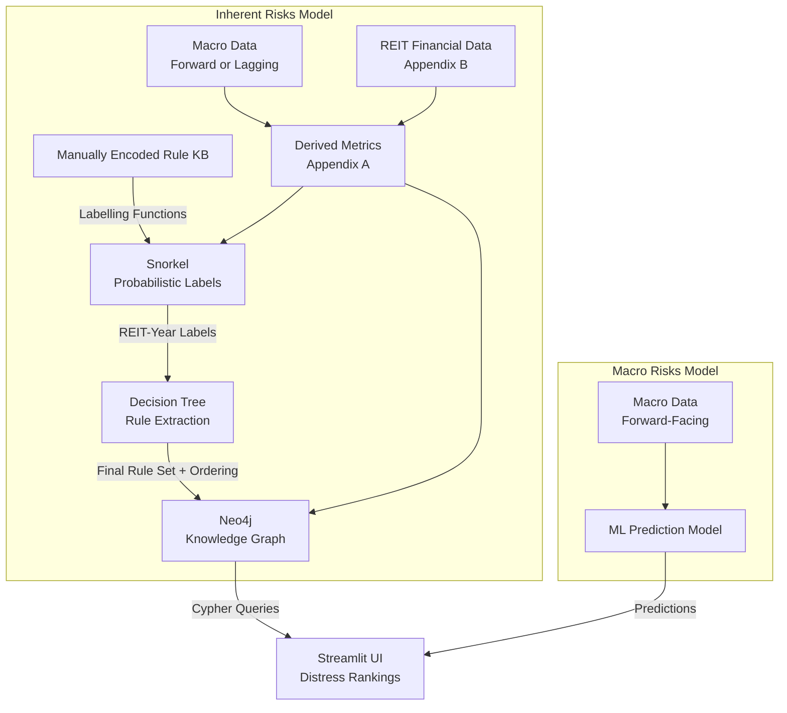

## Project Report

## REITterratsel: Equity Risk Solver for S-REITs

Intelligent Reasoning Systems

Prepared by:

| Student Name | Student ID |
|---|---|
| Jason Tay Neng Wei | A0265092A |

## Table of Contents

| Section | Description |
|---|---|
| 1 | Executive Summary |
| 2 | Business Case / Market Research |
| 3 | System Design / Model |
| 4 | System Development & Implementation |
| 5 | Findings and Discussion |
| 6 | Future Work |
| 7 | References |
| Appendix A | Project Proposal |
| Appendix B | Mapped System Functionalities against MR, RS, CGS Modules |
| Appendix C | Installation and User Guide |

## 1. Executive Summary

<!--- Not Filled in because slop -->

## 2. Business Case / Market Research

## 2.1. Business Case

Singapore REITs (S-REITs) are income-oriented instruments that are highly exposed to financing costs, refinancing structure, and macroeconomic variables, on top of their internal accounting health statistics. 

Recent sector stress is especially relevant because S-REIT balance sheets are sensitive to higher debt costs and refinancing walls. There are known recurrent risks such as debt-cost sensitivity, refinancing risk, and valuation compression. 

For example, geopolitical stress events such as rate regime changes and black swan events (COVID-19, Operation Epic Fury 2026) can propagate into downstream distress for S-REITs, as was demonstrated with notable S-REIT distresses such as Lippo Malls Indonesia Retail Trust (D5IU) and Prime US REIT (OXMU).

Under the revised MAS framework, a REIT with `ICR < 1.5x` can be blocked from taking on additional debt even if its aggregate leverage is still low. In practical terms, a REIT may appear lightly geared on paper yet still face funding stress if weaker earnings push interest coverage below the regulatory threshold.

For example, a REIT with 20% gearing but `ICR = 1.2x` may still be unable to borrow for recovery or refinancing needs, leading to shareholder dilution or price impact.

## 2.2. Competitive Positioning

There are a variety of public, simple yield screens when selecting S-REITs available to Singapore retail investors. 

- **[REITsavvy Screener](https://reitsavvy.com/reits-screener)**, which exposes filters and raw metrics but leaves reasoning to the user.
- **[Fifth Person](http://sreit.fifthperson.com)**, which presents live S-REIT data for general reference but does not encode rule-based distress scoring.
- **[DBS Research InsightsDirect](https://www.dbs.com/insightsdirect/)**, which contains analyst reasoning but is episodic, institutional, and not transparently rerunnable by a retail user.

Existing tools either display metrics without reasoning (REITsavvy, Fifth Person) or apply reasoning episodically behind institutional paywalls (DBS Research). There is a lack of quantitative evaluation available that captures the safety of current S-REITs, or whether current distributions remain sustainable under changing policy and inflation. 

This project addresses that gap by building intelligent reasoning systems that combine macro regime signals with REIT-level financial health indicators.


## 2.3. Literature Review
The existing literature provided several design lessons that were directly useful. Shumway and Campbell showed the value of strictly time-ordered prediction, leakage control, market-informed variables, and lagged path features instead of relying only on static accounting snapshots [1], [2]. Those ideas map well to this project's chronological split, explicit gap rows, realized-volatility inputs, and engineered SORA path features. Martyushev et al. reinforced the same point from a more recent machine-learning perspective: boosted models become more useful when temporal structure is encoded explicitly and holdout evaluation is treated as a first-class requirement [4].

The literature also supported keeping the final output interpretable rather than purely predictive. Cheng, Su, and Li used fuzzy modelling to treat distress as a graded state rather than a hard binary boundary [3], while Campbell et al. showed that higher-frequency market signals can update risk views between slower accounting releases [2]. Those two ideas are reflected in this project's architecture: an annual Mamdani reasoning layer provides the stable accounting anchor, while the macro and CAR-path overlays allow the score to move when conditions change before the next annual filing [2], [3].

At the same time, the existing literature left several gaps that this project chose to address. Shumway, Campbell, and Cheng were built around general corporate distress settings rather than the specific constraints of S-REITs, where leverage rules, refinancing pressure, mandatory distributions, and MAS coverage thresholds can materially affect risk even before formal insolvency [1]-[3]. Martyushev et al. is useful for the XGBoost component, but it does not include a rule-based reasoning layer or a REIT-specific regulatory lens [4]. This project therefore adds explicit domain structure through REIT-specific financial ratios, MAS-linked reasoning, and a distress interpretation layer designed for S-REIT decision support rather than generic firm-failure prediction [1]-[4].

Another gap was architectural. The prior papers generally used single-model prediction pipelines, whereas this project separates the problem into three linked parts: an annual accounting-based fuzzy anchor, a macro rate-stress overlay, and a market-reaction overlay from cumulative abnormal returns. This was a deliberate choice because S-REIT distress is not only a balance-sheet problem. It is also shaped by refinancing conditions and how the market responds after new information arrives. In that sense, the project is less a direct replication of any one paper than a domain-specific synthesis of explainable distress reasoning, market-timed updating, and hybrid modelling for the S-REIT setting [2]-[4].

## 3. System Design / Model

## 3.1. Original Design

The original proposal described a hybrid reasoning architecture that combined manually encoded rules, weak supervision, rule extraction, Neo4j storage, and a Streamlit front end. The design emphasized explainability first, with the macro model acting as an additional overlay rather than replacing the reasoning layer.

The original Mermaid architecture from the proposal is reproduced below because it is still useful for showing the intended starting point:



That original design is important because the final implementation only partially matches it. Neo4j still exists, but it is no longer queried live by the app for rule reasoning. Snorkel and decision-tree induction were proposed, but the local implementation now relies on threshold-derived labels and a seeded Mamdani rule system evaluated in Python. The final architecture is therefore best described as a design evolution rather than a straight proposal-to-code translation.

## 3.2. Data Definitions

## 3.2.1. Labels / Ground Truth

The current local implementation defines annual distress labels from forward cumulative abnormal returns rather than from hand-labelled expert classes. Specifically, the label table `reit_labels.fact_distress_label` stores:

- `car_63wd`
- `car_126wd`
- `label_126wd`
- annual anchor and window-end dates
- `null_count`
- `non_ok_count`

The source logic in `reitteratsel_core.py` compounds abnormal returns from the first trading day on or after each annual fiscal-year-end anchor. The abnormal return itself is defined as:

`REIT daily return - SGX iEdge REIT index daily return`

This design intentionally measures how the market responded to each REIT relative to the sector benchmark rather than asking the model to predict raw price paths.

## 3.2.2. Theoretical Benchmark

Two benchmark ideas appear in the implemented system:

- For the annual rule layer, the relevant benchmark is the ground-truth label `label_126wd`, which is derived from `car_126wd`.
- For the macro layer, the relevant benchmark is the saved holdout evaluation in `Common\Macro\IO\Model_Train\Use\run_21`, where Optuna and DEAP are compared on the same target and holdout split.

The formal evaluation script under `Common\Eval\build_reitteratsel_eval.py` compares four model views:

- `distress_baseline`
- `distress_score_mamdani`
- `distress_score_refi`
- `final_distress`

This is a useful report design because it shows not only whether the full hybrid score works, but also whether the Mamdani layer alone already improves over a simpler baseline.

## 3.2.3. Threshold-Based Label Engineering Rationale

The implemented label thresholds are explicit in `reitteratsel_core.py` and `Design_v1a.txt`:

- `car_126wd < -15%` -> `DISTRESSED`
- `car_126wd > +5%` -> `HEALTHY`
- otherwise -> `WATCH`

This means the annual label is deliberately asymmetric. The distressed class requires a materially negative cumulative abnormal return over 126 trading days, while the healthy class requires clearly positive outperformance. The middle band is treated as ambiguous and therefore mapped to `WATCH`.

This is sensible for a proof-of-concept because the system is trying to identify meaningful market deterioration rather than minor price noise. The design documents also indicate that higher-timeframe windows were preferred because they are less noisy than very short windows and better aligned with annual filing anchors.

In plain language, the label says:

- `DISTRESSED` means the REIT underperformed the sector benchmark badly over roughly half a trading year after the filing anchor.
- `HEALTHY` means it outperformed clearly over the same horizon.
- `WATCH` means the market reaction was not decisive enough to classify as either extreme.

## 3.3. XGBoost / Macro Data Design

The local run artifacts show that the active macro model is not a general price forecaster. It is a SORA-oriented change model. In `run_21`, the selected runtime target is `option2_change`, described as:

`Future SORA change over 10 SGX trading rows`

For the deployed runtime, `DEFAULT_HORIZON_DAYS = 10`, and the app explicitly loads direct XGBoost inference from `run_21`.

The `fwd_10_days\feature_manifest.json` and `run_contents_summary.txt` make the feature design fairly clear. The model uses three broad feature groups:

- Base macro features:
  `sora_level_t2`, `sora_3m_t2`, `sora_term_spread_t2`, `expected_bps`, `p_no_change`, `margin_over_second`, `days_to_next_fomc`, and missingness indicators.
- Spread features:
  `expected_bps_minus_sora_90d`, `sora_curve_steepness`.
- Engineered SORA path features:
  lag differences, realized volatility, drawdown from recent peak, distance from moving average, and acceleration.

The run summary also records that for `option2_change`, the model intentionally excludes `sora_level_t2` and `sora_3m_t2` from the active feature set because those level features are too regime-heavy relative to a change target. That is a meaningful design choice, because it shows the pipeline was trying to predict direction and movement rather than accidentally hard-coding level information that could distort the target.

The 1-fold design is also directly evidenced by the local run metadata:

- `split_mode = custom_1fold`
- `train_frac = 0.7`
- `test_frac = 0.2`
- `gap_rows = 63`
- `rows_base = 869`

Based on those local settings, the 1-fold constraint appears to have been accepted because the dataset is time ordered, the sample size is not huge, and leakage prevention mattered more than producing many reshuffled validation folds. The 63-row gap is especially important because it suggests the pipeline deliberately inserted a temporal separation between training and downstream evaluation windows.

## 3.4. Mamdani Fuzzy Rules / Micro Data Design

The current Mamdani system is seeded from `Common\Micro\5_Model_KG\mamdani_rule_seed.json` and evaluated in Python through `reitteratsel_core.py`. The implemented fuzzy inputs are:

- `ICR`
- `GEARING`
- `DSCR`
- `REFI_RISK`
- `PAYOUT_RATIO`
- `FFO_COVERAGE`
- `NET_DEBT_EBITDA`
- `NULL_COUNT`

This choice is consistent with the local metric dictionary. These variables collectively cover:

- debt-servicing capacity (`ICR`, `DSCR`)
- leverage and refinancing structure (`GEARING`, `REFI_RISK`, `NET_DEBT_EBITDA`)
- payout sustainability (`PAYOUT_RATIO`, `FFO_COVERAGE`)
- data-quality or missingness risk (`NULL_COUNT`)

The output membership functions are not generic labels like "good" and "bad." They are:

- `stable`
- `watch`
- `high`
- `critical`

This is useful for reporting because it matches the practical use case better than a binary classifier. A retail-investor-facing distress dashboard needs intermediate warning states, not just yes-or-no outcomes.

The rule seed shows several high-signal examples:

- `R1`: `ICR = distress` -> `critical`
- `R2`: `DSCR = distress` -> `critical`
- `R4`: `REFI_RISK = critical` -> `critical`
- `R6`: `ICR = watch` and `GEARING = distress` -> `critical`
- `R12`: healthy `ICR`, `GEARING`, `DSCR`, and `REFI_RISK` together -> `stable`

This reveals the intended reasoning style. The system is not treating every metric as independent. It encodes both direct single-metric alarms and corroborating multi-metric combinations.

The code also includes status-aware preprocessing. Certain metrics are not interpreted only by raw value:

- `NEGATIVE_BASE` forces distress-style interpretation for `ICR`, `DSCR`, and `NET_DEBT_EBITDA`
- `DISTRESS_BASE` forces payout-strain interpretation for `PAYOUT_RATIO` and `FFO_COVERAGE`
- `PARTIAL`, `CLIPPED_SOURCE_SHARE`, and `LOW_DENOMINATOR` reduce confidence rather than silently pretending the values are fully normal

That design is important because financial ratios can be numerically valid yet semantically misleading when the denominator or profit base is broken. The local implementation therefore treats metric status as part of the rule input design rather than as a mere metadata field.

<!--FILL The skeleton points to an external ratio-selection justification file at `D:\WS\-GH-A-Ref\...METRICS_FOR_MAMDANI_RULES.txt`. That file is outside this repository, so I cannot fully quote the original external justification for why these exact ratios were chosen over all alternatives. The local repo does support a practical rationale through `Data_Dict_Reit_Metrics.md` and the seeded rule set.-->

## 3.5. Full Pipeline / Hybrid Model

The best way to describe the implemented system is:

`Annual Anchor + Daily Watchdog`

The annual anchor is the persisted Mamdani score in `reit_fuzzy.fact_fuzzy_cache`. It is built from annual fundamentals and remains frozen until the next annual checkpoint.

The daily watchdog adds two faster-moving layers:

- a macro rate-stress overlay derived from the XGBoost-predicted 10-day SORA change
- a REIT-specific abnormal-return-path overlay derived from cumulative abnormal returns since the filing anchor

The final score is assembled in `compute_final_distress_score()`:

- start from `distress_score_mamdani`
- derive a macro shock from `distress_sora - 0.5`
- scale that macro shock by `REFI_RISK`
- derive a `car_path_shock` from `car_path_distress - 0.5`
- ignore small CAR-path shocks inside a neutral dead zone
- combine the pieces into a bounded final score

In the current code, the exact formula is:

- `macro contribution = 0.15 * sensitivity * macro_shock`
- `car contribution = 0.20 * car_path_shock`
- `sensitivity = max(0.25, min(1.0, REFI_RISK * 2.5))`

This produces a hybrid score that still preserves the annual reasoning base while allowing more recent macro and market developments to move the final ranking.

The main design gap between proposal and implementation is therefore clear:

- The proposal centered Snorkel, decision-tree rule extraction, and Neo4j-backed live reasoning.
- The implementation centers threshold-derived labels, Python Mamdani inference, persisted DuckDB caches, and runtime composition.

Neo4j still matters, but mainly as the rebuild-time rule seed store rather than the runtime decision engine used by the app.

## 3.6. UI Prototype

The repo contains both concept and implementation artifacts for the front end:

- `Common\Frontend\DesignDoc\Reitteratsel.pdf`
- `Common\Frontend\DesignDoc\figma.png`
- `Common\Frontend\DesignDoc\Reiterratsel_Wordmark.svg`
- `Common\Frontend\reitteratsel_app.py`

The implemented Streamlit app currently exposes three pages:

- `Ranking`
- `Individual REIT Navigator`
- `Time Series (Rates)`

The code shows that the UI is not a bare prototype. It includes:

- simulation-date resolution
- persistent REIT selection across navigation
- annual, macro, and CAR-path provenance tooltips
- ranking-table views
- detailed single-REIT score decomposition
- time-series charts for predicted versus actual macro behavior

The visual direction is a dark dashboard with strong information hierarchy, custom branding assets, and explicit explanatory help text around most model-derived fields. This is aligned with the project's interpretability goal: the interface is meant to explain why the score moved, not only display the score.

<!--FILL The skeleton asks to include prototype screenshots and likely compare against the Figma design. The local repo contains the PDF and image assets, but I did not render or extract screenshots from those binary design files during this pass. Add screenshots in a later pass if needed.-->

## 4. System Development & Implementation

## 4.1. Early Development / Dead Forks

The proposal shows that the project originally intended to use Snorkel weak supervision and decision-tree rule extraction. That direction was methodologically attractive because the annual S-REIT dataset is small and does not come with an obvious labelled distress target. However, the final local implementation did not keep Snorkel in the production path.

The current design documents and code show a different final outcome:

- annual labels are engineered directly from forward cumulative abnormal returns
- Mamdani rules are manually seeded and evaluated in Python
- DuckDB stores the resulting annual labels and fuzzy outputs for runtime reuse

This is not a minor implementation detail. It means the project moved away from an "induce labels from weak supervision" workflow toward a more explicit threshold-based labelling strategy that could be audited end to end.

As a result, Snorkel labelling was abandoned and threshold-based labelling was adopted instead. See Section 4.2.1.

<!--FILL The skeleton asks for specific discussion of Snorkel, Decision Tree, and Orange experiments using folders under `D:\WS_NUS\REF_DATA\...` and `IVT_Dividends\...`. Those artifacts are outside this repository, so I cannot verify the detailed experimental outcome or quote the exact Orange findings from local evidence.-->

## 4.2. Data Scraping and Data Engineering

The implemented data-engineering path exists in both the folder structure and the active build scripts. On the micro / firm side, the repository contains a staged pipeline:

- `Common\Micro\1_TradingView_Exploration`
- `Common\Micro\2_HTML_Dumping`
- `Common\Micro\3_Serialize_Dump_To_CSV_Parquet`
- `Common\Micro\4_Compute_Metrics`
- `Common\Micro\5_Model_KG`

This staged structure implies a practical progression:

- inspect upstream TradingView-style data
- dump or capture raw source content
- serialize into CSV / parquet form
- compute derived REIT metrics
- build reasoning and downstream application layers

On the macro side, `Common\Macro\Pipeline_DATA` is also staged and strongly supports the user's skeleton notes about probing and sanity checking. The local scripts show separate phases for:

- market probing
- legacy probing
- preprocessing
- extraction

Examples include:

- `probe_trades_schema_by_market.py`
- `check_trade_timestamp_availability.py`
- `assemble_ref_overlap_parent_columns.py`
- `parquet_fed_events_export.py`
- `build_timeseries.py`

This is good reporting evidence because it shows the macro dataset was not treated as a ready-made clean table. The pipeline explicitly includes schema probing, overlap assembly, and extraction steps before the training data reaches the model layer.

The proposal and implementation docs also show that the project uses multiple source families:

- TradingView-style S-REIT financial statements
- S-REIT and index price-series CSVs
- SORA daily and SORA 3M series
- FOMC-related forward-signal features summarized in the run artifacts as `expected_bps`, `p_no_change`, `margin_over_second`, and `days_to_next_fomc`

The annual warehouse is persisted in DuckDB at:

`Common\Micro\IO\out\_annual_warehouse\fundamentals.duckdb`

This warehouse is a major implementation choice. It allows the application to use stable, queryable annual snapshots instead of re-deriving everything live during every app interaction.

<!--FILL The skeleton claims a custom plugin was built for scraping firm-level financial data. I did not find a clearly identifiable local plugin artifact or plugin source folder inside this repository that proves that statement in detail. The staged micro pipeline supports custom scraping work in general, but the plugin-specific claim needs a local source or a separate external reference.-->

## 4.2.1. Threshold-Based Annual Label Engineering

This is one of the clearest fully implemented parts of the project. The code path in `reitteratsel_core.py` does the following:

- derives annual filing anchors from `reit_metrics.dim_period.fiscal_year_end_date`
- rolls the anchor to the first available trading day on or after that date
- compounds forward abnormal returns for 63 and 126 trading days
- stores the results in `reit_labels.fact_distress_label`
- maps `car_126wd` to `label_126wd`

The threshold logic is explicit:

- if `car_126wd < -15%`, the label is `DISTRESSED`
- if `car_126wd > +5%`, the label is `HEALTHY`
- otherwise the label is `WATCH`

In plain English, this means:

- the market judged the REIT badly if it underperformed the REIT index by more than 15% over the next 126 trading days
- the market judged it positively if it outperformed by more than 5%
- anything in between is treated as a middle-risk watch state

This section is also where the earlier weak-labelling idea was functionally replaced. Instead of relying on a generative label model, the project engineered a consistent downstream target from actual post-filing market behavior.

## 4.3. XGBoost Development

## 4.3.1. Multi-Configuration Controlled Experiment Design

The local training code and run artifacts show a structured experimental approach rather than a single one-off model fit.

The script configuration records:

- default forward horizons `(10, 15)`
- alternative historical notes for `(3, 7, 10, 15)` and `(1, 5, 10, 21)`
- three target types listed in the manifests:
  `option1_level`, `option2_change`, `option3_abs_change`
- active run target in `run_21`:
  `option2_change`

This matches the skeleton's description of a controlled experiment across multiple labels and horizons. The final deployed direction is not "predict anything possible." It is the one that survived comparative selection and became stable enough for runtime wiring.

The active runtime choice is:

- forward horizon: `10` trading days
- target: `sora_fwd_10d_change`
- winner: `optuna`

That makes the runtime model operationally simple: the macro layer predicts a short-horizon change in SORA and converts that into a 0-1 stress overlay.

## 4.3.2. Hyperparameter Search Strategy

The project uses two optimizer families in the training pipeline:

- Optuna with `OPTUNA_N_TRIALS = 80`
- DEAP with a conservative evolutionary search

The DEAP settings are explicitly visible in `train_p_1fold_pipeline.py`:

- `DEAP_GENERATIONS = 8`
- `DEAP_POPULATION_SIZE = 20`
- `DEAP_MUTATION_PROB = 1.0 / 9.0`
- `DEAP_CROSSOVER_PROB = 0.6`
- `DEAP_TOURNAMENT_SIZE = 3`

The script comments are useful for report interpretation because they explicitly describe the DEAP search space as conservative for the "current small-row regime." That supports the skeleton's narrative that more aggressive evolutionary settings had to be reined in to improve generalization.

The saved `run_21` comparison confirms that Optuna narrowly beat DEAP for the deployed `fwd_10_days` change target:

- Optuna:
  `R2 = 0.1927`, `RMSE = 0.2528`, `Accuracy = 0.6795`, `Recall = 0.7385`, `F1 = 0.6575`, `AUC = 0.7341`
- DEAP:
  `R2 = 0.1919`, `RMSE = 0.2529`, `Accuracy = 0.6538`, `Recall = 0.7231`, `F1 = 0.6351`, `AUC = 0.7219`

The winning parameter set stored in `all_targets_selected_params.json` is:

- `gamma = 0.3615`
- `n_estimators = 350`
- `max_depth = 2`
- `learning_rate = 0.0674`
- `min_child_weight = 4.0044`
- `subsample = 0.9193`
- `colsample_bytree = 0.9546`
- `reg_alpha = 0.0068`
- `reg_lambda = 2.3435`

This is a relatively conservative, shallow tree configuration, which is consistent with the project's small-sample design constraints.

## 4.4. Pipeline and Application Delivery

The end-to-end local implementation can be summarized in a sequence of concrete components:

- upstream micro data preparation under `Common\Micro\1_*` to `4_*`
- annual metric derivation by `Common\Micro\4_Compute_Metrics\build_reit_metrics.py`
- hybrid pipeline build by `Common\Micro\5_Model_KG\build_reitteratsel_pipeline.py`
- core logic in `Common\Micro\5_Model_KG\reitteratsel_core.py`
- local development orchestration in `Common\Micro\5_Model_KG\run_reitteratsel.py`
- frontend entrypoint in `Common\Frontend\reitteratsel_app.py`
- formal evaluation in `Common\Eval\build_reitteratsel_eval.py`

The application itself is intentionally built on persisted outputs rather than on raw live recomputation at page-load time. At runtime, the app reads:

- annual metric tables
- annual label tables
- annual Mamdani cache tables
- daily CAR-path tables
- direct macro prediction outputs from the saved XGBoost artifacts

This is a strong practical implementation choice for a submission repository because it improves reproducibility and reduces operational dependence on live graph rebuilds.

## 5. Findings and Discussion

## 5.1. Evaluation for XGBoost Best Version

The best locally evidenced macro model is the `run_21` `fwd_10_days` `option2_change` model, where Optuna is the recorded winner over DEAP. It predicts the 10-trading-day forward SORA change and is the exact family wired into the runtime app.

Its holdout summary is:

- `R2 = 0.1927`
- `RMSE = 0.2528`
- `MAE = 0.2086`
- `Accuracy = 0.6795`
- `Precision = 0.5926`
- `Recall = 0.7385`
- `F1 = 0.6575`
- `AUC = 0.7341`

These are not "perfect prediction" numbers, but they are enough to justify using the macro model as an overlay rather than as the sole decision engine. That is also exactly how the system uses it. The XGBoost layer does not replace the annual reasoning layer. It nudges the final distress score in response to short-horizon rate stress.

## 5.2. Evaluation for XGBoost Historical Versions

The historical working directory exists and contains many earlier runs:

- `Common\Macro\IO\Model_Train\Working\run_0` through `run_28`

The folder also contains the safe artifacts named in the skeleton, including `shap_summary_bar.png` and `shap_summary_beeswarm.png` in multiple historical runs.

However, I did not build a reliable cross-run historical comparison table from the `Working` folder during this pass because the skeleton explicitly constrained what should be read there, and the needed comparative narrative was not already consolidated in a local summary document inside this repository.

<!--FILL A proper historical-version subsection should be completed from `Common\Macro\IO\Model_Train\Working` by reviewing the allowed SHAP images and statistics JSON files across the relevant run range. I did not find a ready-made local summary that states which exact historical runs correspond to each issue mentioned in the skeleton.-->

## 5.3. Evaluation for Mamdani Layer and Full Pipeline

The latest local evaluation output folder is:

`Common\Eval\IO\run_3`

This appears to be the current canonical final evaluation in the repository because the `IO` folder contains `run_1`, `run_2`, and `run_3`, and `run_3` is the highest-numbered run present.

The local evaluation exports include:

- `reitteratsel_eval_summary.csv`
- `reitteratsel_eval_per_class_metrics.csv`
- `reitteratsel_eval_confusion_matrices.csv`
- `reitteratsel_eval_ranking_metrics.csv`
- `reitteratsel_eval_disagreements.csv`
- `reitteratsel_eval_detail.csv`

The summary metrics show:

| Model | Label Accuracy | Macro F1 | MCC | Continuous MAE | Continuous RMSE |
|---|---:|---:|---:|---:|---:|
| `distress_baseline` | 0.3572 | 0.3553 | 0.0538 | 0.3534 | 0.4747 |
| `distress_score_mamdani` | 0.5563 | 0.5294 | 0.2969 | 0.3100 | 0.3635 |
| `distress_score_refi` | 0.2816 | 0.2817 | 0.2261 | 0.3638 | 0.5175 |
| `final_distress` | 0.5214 | 0.5188 | 0.2919 | 0.2724 | 0.3295 |

The results are interesting because they show a trade-off:

- The Mamdani annual layer has the best label accuracy.
- The final hybrid score has slightly lower label accuracy than Mamdani alone.
- The final hybrid score has the best continuous-error metrics.

That is consistent with the architecture. The hybrid score is not only trying to reproduce the annual class label. It is also trying to behave more smoothly as a continuous runtime risk score after adding macro and CAR-path information.

## 5.4. Representation Tables and Graphs

The repo already contains several directly usable report artifacts:

- XGBoost holdout summaries in `run_21`
- SHAP visual assets in `run_21`
- confusion matrices and per-class metrics in `Common\Eval\IO\run_3`

The full-pipeline confusion matrices already reveal meaningful behavior. For example:

- `distress_score_mamdani` correctly predicts `1,594` distressed rows and `4,811` watch rows.
- `final_distress` correctly predicts `1,991` distressed rows, but does so more aggressively by also pulling more watch rows into the distressed bucket.

This supports the skeleton's intuition that the hybrid model is more aggressive. It improves distressed-case capture, but it also increases over-flagging pressure on borderline names.

<!--FILL The skeleton mentions adding more realistic graphs such as residual plots or more specific confusion-matrix views. Those visuals are not yet generated as dedicated report-ready images in the local repo, even though the raw CSV outputs needed for plotting are present.-->

## 5.5. Optuna and DEAP as an Adversarial Error-Surfacing System

One useful way to describe the macro training pipeline is that the optimizer contest was not only a tuning step. It also acted as an error-surfacing mechanism. The local code and saved run artifacts support several points from the skeleton:

- the model-selection logic became important enough to formalize in `choose_winner(...)`
- Optuna trial count was explicitly set to `80`
- DEAP search settings were deliberately constrained for the small-row regime
- mutation and crossover are no longer naively extreme in the saved script

The final script suggests that the project converged toward a more disciplined search regime:

- small population
- small number of generations
- shallow trees
- moderate mutation probability
- moderate crossover probability

This matters because aggressive evolutionary search can easily optimize noise in small temporal datasets. The local comments and parameter caps imply that the final configuration was chosen to reduce that risk.

<!--FILL The skeleton asks for a documented narrative tying specific issues to runs 9-21 and to external notes under `..\REF_SELF\IRS\Working\Data\ForBoth\Consolidate_Processing.txt`. Those substantiating logs are outside this repository, so I cannot map each optimizer issue to its original discovery evidence from local sources alone.-->

## 5.6. Developed Models and Final Interpretation

The repo supports four conceptually distinct views of distress:

- `distress_baseline`
- `distress_score_mamdani`
- `distress_score_refi`
- `final_distress`

The annual Mamdani layer is the strongest single discrete classifier in the local evaluation. It improves substantially over the baseline and over the simple REFI-only proxy.

The final hybrid score appears to be more operationally aggressive. From the per-class metrics:

- `final_distress` distressed recall is `0.8545`
- `final_distress` distressed precision is `0.4413`
- `distress_score_mamdani` distressed recall is `0.6841`
- `distress_score_mamdani` distressed precision is `0.4510`

This means the hybrid score catches more distressed cases, but it also accepts more false alarms. That is almost exactly the trade-off implied in the skeleton note that the hybrid model may catch around 70 to 80 percent of distressed cases while remaining aggressive.

The practical interpretation is:

- Mamdani is the more stable annual reasoning core.
- The final hybrid score is the more sensitive live-monitoring view.
- Model `P` has enough signal to justify inclusion as a macro overlay, but not enough evidence to replace the reasoning system entirely.

## 6. Future Work

The proposal and implementation checklist together suggest a coherent future-work agenda.

First, the current repository is intentionally built on frozen and simulation-resolved data rather than on a live production feed. That is a good choice for reproducibility, but it also means the system is still a proof of concept. A production version would need:

- reliable live ingestion for both firm-level and macro data
- scheduled warehouse refresh
- automated cache rebuild orchestration
- stronger monitoring around failed upstream refreshes

Second, the current label scheme and final hybrid weights are explicitly not final. The local checklist still marks several items as unfinished:

- threshold tuning beyond the current `-15% / +5%` scheme
- deeper Mamdani calibration
- possible inclusion of `non_ok_count` in the scoring logic
- macro and CAR-path weighting refinement

Third, the app itself is functional but still has room for a more mature front end:

- browser-level QA
- richer rule-firing visualization
- closer visual alignment with the design artifacts
- better responsive handling

Fourth, the proposal's broader ambitions remain valid:

- expand coverage to more REITs or adjacent dividend vehicles
- build a more formal MLOps pipeline
- test additional macro experts or macro targets
- extend the system into a more general explainable investment-risk framework

## 7. References

Local repository references:

- `Common\PROJECT_REFERENCE_MAP.md`
- `SAMPLES\Mine\Proposal_Temp_04.md`
- `SAMPLES\Mine\MAS_Rule_Change_Risk_Implications.txt`
- `Common\Micro\5_Model_KG\DesignDocs\Design_v1a.txt`
- `Common\Micro\5_Model_KG\DesignDocs\Implementation_Checklist_v1a.md`
- `Common\Micro\5_Model_KG\mamdani_rule_seed.json`
- `Common\Micro\5_Model_KG\reitteratsel_core.py`
- `Common\Micro\4_Compute_Metrics\Data_Dict_Reit_Metrics.md`
- `Common\Macro\Pipeline_MODEL\5_XGBoost\train_p_1fold_pipeline.py`
- `Common\Macro\IO\Model_Train\Use\run_21\...`
- `Common\Eval\IO\run_3\...`
- `README.md`

External references already named in the local proposal:

- Ratner, A., Bach, S., Ehrenberg, H., Fries, J., Wu, S., and Re, C. (2017). *Snorkel: Rapid Training Data Creation with Weak Supervision*.
- BDO Singapore (2025). *REIT Leverage and Disclosure*.
- [1] T. Shumway, "Forecasting Bankruptcy More Accurately: A Simple Hazard Model," *The Journal of Business*, vol. 74, no. 1, pp. 101-124, 2001, doi: 10.1086/209665.
- [2] J. Y. Campbell, J. Hilscher, and J. Szilagyi, "In Search of Distress Risk," *NBER Working Paper* no. 12362, 2006.
- [3] W.-Y. Cheng, E. Su, and S.-J. Li, "A financial distress pre-warning study by fuzzy regression model of TSE-listed companies," *Asian Academy of Management Journal of Accounting and Finance*, vol. 2, no. 2, pp. 75-93, 2006.
- [4] N. V. Martyushev, V. Spitsin, R. V. Klyuev, L. Spitsina, V. Yu. Konyukhov, T. A. Oparina, and A. E. Boltrushevich, "Predicting firm's performance based on panel data: Using hybrid methods to improve forecast accuracy," *Mathematics*, vol. 13, no. 8, p. 1247, 2025, doi: 10.3390/math13081247.

## Appendix A. Project Proposal

The local proposal can already be summarized into a concise appendix-ready form:

- Project title:
  `REITterratsel - Equity Risk Solver for S-REITs`
- Core problem:
  transform fragmented S-REIT financial and macro data into an interpretable distress-ranking workflow.
- Original technique mix:
  knowledge-based reasoning, weak supervision, rule extraction, Neo4j knowledge graph, and Streamlit interface.
- Key change since proposal:
  the final implementation replaced Snorkel-centric labelling with threshold-based label engineering from cumulative abnormal returns.

If a full appendix copy is preferred, the raw proposal is already available at:

`SAMPLES\Mine\Proposal_Temp_04.md`

## Appendix B. Mapped System Functionalities against MR, RS, CGS Modules

The project clearly satisfies the requirement to integrate at least three IRS-related technique groups.

## Appendix B.1. Decision Automation

The Mamdani fuzzy layer is the clearest decision-automation component. It encodes domain logic into explicit rules and turns annual financial conditions into a structured distress score. The rule bundle includes direct solvency alarms, corroborating multi-metric alarms, and stability rules, which together form a machine-executable decision framework rather than a descriptive dashboard only.

## Appendix B.2. Business Resource Optimization / Evolutionary Computing

The XGBoost macro pipeline uses Optuna and DEAP for structured hyperparameter search. This is the strongest local evidence for the optimization-technique requirement. The search layer is not decorative; it materially affects which macro model configuration is promoted into the runtime overlay.

## Appendix B.3. Knowledge Discovery and Data Mining

The project contains substantial data-mining and engineering work across both the micro and macro sides:

- staged financial-statement extraction and serialization
- annual metric derivation
- market and macro schema probing
- engineered macro feature creation
- label derivation from abnormal-return behavior

This is not merely static reporting. It is a pipeline that turns raw heterogeneous data into model-ready and rule-ready information.

## Appendix B.4. Cognitive Techniques / Tools

The original architecture and the current rebuild path both involve Neo4j. In the implemented system, Neo4j is used to seed and persist the Mamdani rule graph, even though the runtime app now reads the persisted fuzzy outputs from DuckDB rather than querying Neo4j live on every page interaction. The graph layer therefore remains a real cognitive-systems component, even if it is no longer the direct runtime serving layer.

<!--FILL The skeleton asks for explicit module-link evidence using external notes under `D:\WS\-GH-A-Ref\...`. Those module-link documents are outside this repository, so I can map the techniques conceptually but cannot verify the exact slide/day references from local sources alone.-->

## Appendix C. Installation and User Guide

The repository README is already strong enough to support a largely complete appendix.

### C.1. Docker submission / demo mode

From the repository root:

```powershell
docker compose -f Common/docker-compose.yml up --build
```

Then open:

```text
http://localhost:8501
```

This serves the Streamlit app against the committed DuckDB snapshot and does not require Neo4j-backed rebuild logic for the normal demo path.

### C.2. Docker rebuild mode

If the cached DuckDB and parquet artifacts need to be regenerated, first create:

```powershell
Copy-Item Common\docker-compose.env.example Common\docker-compose.env
```

Then keep the Neo4j container settings aligned with the compose path, including:

```env
NEO4J_URI=neo4j://neo4j:7687
NEO4J_DATABASE=neo4j
NEO4J_USERNAME=neo4j
NEO4J_PASSWORD=mamdaniXGBoost
```

Run the rebuild profile:

```powershell
docker compose -f Common/docker-compose.yml --profile rebuild up --build reitteratsel-rebuild
```

After that, start the app:

```powershell
docker compose -f Common/docker-compose.yml up --build
```

### C.3. Local development mode

The project-standard Python runtime is:

- `C:\ProgramData\anaconda3\envs\env\python.exe`
- `C:\ProgramData\anaconda3\envs\env\Scripts\streamlit.exe`

Typical local development entrypoint:

```powershell
C:\ProgramData\anaconda3\envs\env\python.exe Common\Micro\5_Model_KG\run_reitteratsel.py
```

Important local-development notes:

- development mode assumes cache rebuild on launch
- root `.env` must contain the required Neo4j settings
- submission mode differs because it serves the committed DuckDB snapshot directly

### C.4. Main user-facing pages

The app exposes three primary pages:

- `Ranking`
- `Individual REIT Navigator`
- `Time Series (Rates)`

The user can:

- choose a simulation date
- inspect annual Mamdani scores
- view macro overlay fields
- view abnormal-return-path overlays
- drill into annual metric history and label history for a selected REIT
